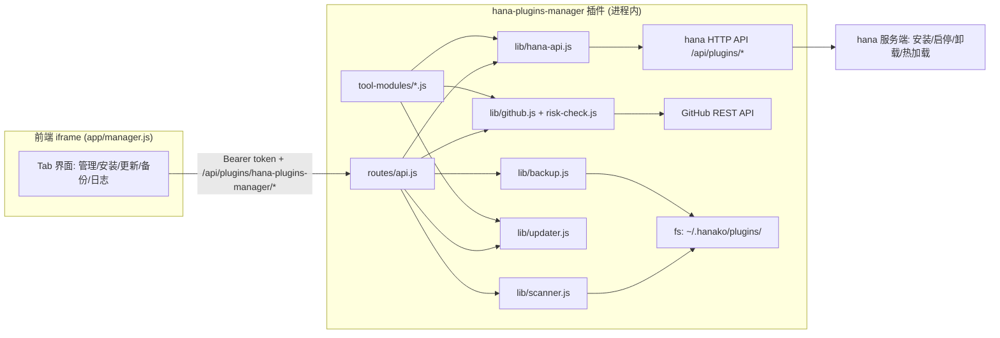

## 产品概述

开发一个 hanaagent 插件管理插件（hana-plugins-manager），用于管理 hanaagent 已安装的插件。参考已成功运行的 dsh-plugin-manager 的架构与交互模式，面向 hanaagent 的插件协议重新实现。插件安装在系统盘 hana 主目录（本机为 `~/.hanako`，兼容用户所述的 `.hanaka`）下的 `plugins` 目录。

## 核心功能

- **主管理界面**：展示已安装插件列表（名称、版本、信任等级、启用状态）。支持单个更新、一键更新全部、卸载、启用、停用。每个插件详情支持输入并关联 GitHub 地址（用于后续更新检测）。
- **插件安装**：
- 方式一：用户提供 GitHub 仓库地址，下载源码，执行风险检测（信任等级、敏感能力、可疑代码模式），展示风险报告后由用户确认安装。
- 方式二：用户导入本地插件压缩包（zip）或文件夹，校验插件结构后安装。
- **备份与还原**：全量备份 `plugins` 文件夹；还原支持单个插件还原与全量还原（还原前自动备份当前状态）。
- **更新功能**：提供"一键更新"按钮，批量检测所有已关联 GitHub 地址的插件，对比本地与远端版本，由用户勾选后逐个更新；更新前自动备份旧版本。
- **Agent 工具**：提供列表/安装/卸载/启停/更新 5 个 Agent 可调用工具，支持对话式管理。
- **操作日志**：记录最近 50 条操作，便于追溯。

## 视觉效果

单页 iframe 应用，顶部 Tab 导航（插件管理/安装/更新/备份还原/操作日志），卡片式插件列表，状态条展示 hana 主目录与连接状态，操作反馈使用 toast 与实时任务输出，整体适配 hanaagent 暖纸主题。

## 技术栈选择

- **运行环境**：Node.js（ESM），零第三方 npm 依赖（与 dsh-plugin-manager 一致，避免 hana dev install 重置 node_modules 导致依赖丢失）
- **前端**：原生 HTML + CSS + Vanilla JS（iframe 内嵌，CSS/JS 内联注入，复用 hana 主题系统 `hana-css`/`hana-theme`）
- **服务端 HTTP 框架**：hana 插件框架自带 Hono（`routes/api.js` 导出默认函数挂载）
- **zip 解压**：纯 Node 内置实现（解析 zip 本地头 + `zlib.inflateRawSync`，支持 STORED/DEFLATE，防 zip-slip）
- **网络请求**：Node 内置 `fetch`（Node 18+），GitHub REST API 与 hana 内部 HTTP API

## 实现方案

### 总体策略

复用 dsh-plugin-manager 的分层架构（manifest → 生命周期 → 路由 → lib 业务模块 → Agent 工具 → 前端），但业务逻辑完全面向 hanaagent 插件协议重写。插件管理操作优先调用 **hana 自带 HTTP 管理 API**（`GET /api/plugins`、`POST /api/plugins/install`、`DELETE /api/plugins/:id`、`PUT /api/plugins/:id/enabled`、`GET /api/plugins/settings`），端口与 Bearer token 从 `${HANA_HOME}/server-info.json` 读取；该方式由 hana 服务端完成 staging、格式校验、降级保护、安装期备份、热加载与失败回滚，无需重启即生效。API 不可用（未运行/鉴权失败）时降级为 fs 直接操作（扫描 `plugins/` 目录、编辑 `preferences.json` 的 `disabled_plugins`），并提示重启 hana 生效。

### 关键决策与理由

1. **hana home 探测**：`env HANA_HOME` > 插件配置 `hanaHome` > `~/.hanako` > `~/.hanaka` > 探测 `server-info.json`，选择持久化到 `current-home.json`（复用 homes.js 模式）。本机实测为 `.hanako`，用户所述 `.hanaka` 作为兼容候选。
2. **插件列表**：以 `GET /api/plugins?source=community` 实时数据为准（含启用状态、加载状态），合并 fs 扫描 `plugins/*/manifest.json` 的版本/信任信息与 `<dataDir>/plugin-sources.json` 的 GitHub 关联；API 不可用时纯 fs 扫描并标注"需重启生效"。
3. **安装链路**：GitHub 方式 = 解析 owner/repo → GitHub API 获取仓库信息与默认分支 → codeload 下载 zip → 解压到 `<dataDir>/tmp/staging/` → 风险检测 → 用户确认 → `POST /api/plugins/install {path}`。本地方式 = 用户选择 zip/目录 → zip 校验（manifest.json 必需字段、index.js/贡献目录存在）→ 风险检测 → 确认 → install。风险检测输出三态（高/中/低）清单：`trust` 等级、`capabilities`/`sensitiveCapabilities`、`minAppVersion` 与当前 hana 版本兼容性、递归扫描 js/ts 的 `child_process`/`eval(`/`Function(`/硬编码网络地址/超长 base64 等可疑模式。
4. **更新机制**：插件关联 GitHub 后，拉取远端默认分支 `manifest.json` 的 `version`（或 releases 最新 tag）与本地对比（精简 semver 比较，不引依赖）；批量检测并行执行并缓存 5 分钟防限流；用户勾选后逐个走 下载+风险检测+install，hana 自带 `plugin-backups` 自动备份与降级保护（需 `allowDowngrade: true` 才允许降级，UI 默认拒绝）。
5. **备份还原**：纯 fs 操作。全量复制 `plugins/` → `<dataDir>/backups/plugins/<时间戳>/` 并写 `meta.json`；还原单插件 = 先备份当前版本 → 覆盖目标目录；全量还原 = 先备份当前 → 清空 `plugins/` → 整体拷回；支持备份列表/删除/备注，保留最近 10 条。
6. **长任务**：安装/更新为同步请求（hana install 接口本身是同步的），前端用 loading 态 + 失败时展示服务端错误；不引入 job 轮询（区别于 dsh 的 CLI 异步），降低复杂度。
7. **安全边界**：插件 id/路径段做字符白名单（`[a-zA-Z0-9._-]`）防路径穿越；zip 解压防 zip-slip；GitHub 下载大小限制（50MB）；spawn 不用于安装（纯 HTTP + fs）。

### 性能与可靠性

- 列表接口 60s 缓存，GitHub 更新检测 5min 缓存（限流时 3min 重试），避免重复请求。
- 批量更新检测并行（`Promise.allSettled`），单仓库失败不影响其余。
- 所有写操作前自动备份；install 失败由 hana 服务端自动回滚旧版本。
- 日志复用 `ctx.log`，不记录 token 等敏感信息；操作日志截断长输出（尾部 500 字符）。

### 避免技术债

- 完全复用 dsh-plugin-manager 已验证的架构模式（生命周期/路由/工具注册/前端鉴权），不引入新框架。
- 零 npm 依赖，与参考项目一致；zip/解压/semver 均内置实现。
- 模块按单一职责拆分（scanner/hana-api/risk-check/updater/backup 等），与参考项目文件命名风格统一。

## 架构设计



## 目录结构

全部文件新建于 `c:/Users/Administrator/Desktop/OH-WorkSpace/Desk/码农/hana-plugins-manager/`：

```
hana-plugins-manager/
├── manifest.json            # [NEW] 插件声明。id=hana-plugins-manager、page 贡献（title「Hana 插件」/route /manager）、capabilities filesystem.read/write、configuration 属性 hanaHome（留空自动探测）
├── package.json             # [NEW] type=module、main=index.js、dependencies 为空、scripts.smoke
├── index.js                 # [NEW] 生命周期入口。onload：探测 hana home、初始化 dataDir 与操作日志、通过 ctx.registerTool 注册 5 个 Agent 工具（失败不阻塞）；onunload：注销工具、清理 tmp
├── lib/
│   ├── plugin-context.js    # [NEW] ctx 单例（hanaHome/dataDir/log/configGet），供路由与工具共享
│   ├── homes.js             # [NEW] hana home 探测与持久化：env HANA_HOME > 配置 > ~/.hanako > ~/.hanaka > server-info.json 探测；读写 current-home.json；listCandidates
│   ├── hana-api.js          # [NEW] 读取 server-info.json 的 port+token，封装 request() 调 hana 内部 API：listPlugins/install/uninstall/setEnabled/getSettings/getDiagnostics；返回 {ok,error}，API 不可用时置降级标记
│   ├── scanner.js           # [NEW] fs 扫描 plugins/ 目录：解析各插件 manifest.json（id/name/version/trust/minAppVersion）、合并 preferences.json disabled_plugins 状态与 plugin-installs.json 安装记录
│   ├── sources.js           # [NEW] GitHub 关联存储：读写 <dataDir>/plugin-sources.json（pluginId→{githubUrl}）；自动从 manifest.repository 识别
│   ├── zip-native.js        # [NEW] 纯 Node zip 解压（STORED/DEFLATE、防 zip-slip、拒绝加密/分卷），复用参考项目解析思路
│   ├── zip-check.js         # [NEW] 解压到临时目录并校验插件结构：manifest.json 必需字段、index.js/index.ts 或贡献目录存在；返回 {ok, pluginRoot, manifest, errors, cleanup}
│   ├── risk-check.js        # [NEW] 风险检测：manifest 信任等级/敏感能力/minAppVersion 兼容性 + 递归扫描 js/ts 可疑模式（child_process、eval、Function、硬编码 IP、超长 base64 等），输出 {level, findings[]}
│   ├── github.js            # [NEW] GitHub 封装：解析 URL、仓库信息、默认分支 manifest.json/version 读取、releases 最新 tag、codeload zip 下载（限 50MB、支持可选 GITHUB_TOKEN）
│   ├── updater.js           # [NEW] 版本对比（精简 semver）、批量检测（并行+5min 缓存）、执行更新=下载+风险检测+install
│   ├── backup.js            # [NEW] 全量备份 plugins/ → backups/plugins/<时间戳>/ 写 meta.json；列表/删除/备注；单插件还原（先备份当前）；全量还原（先备份→清空→拷回）
│   └── operation-log.js     # [NEW] 追加/读取最近 N 条操作日志（appendLog/readRecentLogs），存 <dataDir>/operations.log
├── routes/
│   └── api.js               # [NEW] 全部 HTTP 路由：/page /manager（iframe shell 内联 CSS/JS+注入 HANA_PLUGIN_BASE/TOKEN）、/api/status、/api/homes、/api/current-home、/api/plugins（列表）、/api/plugins/:id（详情）、/api/plugins/:id/source（GitHub 关联读写）、/api/install/github-analyze（解析+分析+风险预检）、/api/install/github-apply、/api/install/local（zip/目录导入+风险检测）、/api/uninstall、/api/toggle、/api/updates/check、/api/updates/apply、/api/backups、/api/backup、/api/restore、/api/restore/plugin、/api/logs、/api/browse
├── tool-modules/
│   ├── hana-list-plugins.js     # [NEW] Agent 工具：列出已安装插件（含启用状态/GitHub 关联）
│   ├── hana-install-plugin.js   # [NEW] Agent 工具：安装（github url / 本地 zip / 目录，含风险检测摘要返回）
│   ├── hana-uninstall-plugin.js # [NEW] Agent 工具：卸载指定插件
│   ├── hana-toggle-plugin.js    # [NEW] Agent 工具：启用/停用指定插件
│   └── hana-update-plugin.js    # [NEW] Agent 工具：检查/执行指定插件更新
├── app/
│   ├── manager.css              # [NEW] 前端样式：适配 hana 暖纸主题、卡片/抽屉/Tab/toast/加载态
│   └── manager.js               # [NEW] 前端逻辑：Tab 切换、插件列表渲染、详情抽屉（GitHub 关联）、安装向导（GitHub/本地）、批量更新勾选、备份还原操作、操作日志轮询
└── scripts/
    └── smoke-test.mjs           # [NEW] 自测脚本：模块加载、路径安全、zip 解析、semver 对比、GitHub URL 解析（纯离线用例）
```

## 关键代码结构

### manifest.json（hana 插件声明契约，决定插件能否被 hana 识别与加载）

```
{
  "manifestVersion": 1,
  "id": "hana-plugins-manager",
  "name": "Hana 插件管理",
  "version": "0.1.0",
  "description": "管理本机 hanaagent 的插件：列表/安装/更新/卸载/启停/备份还原，支持 GitHub 与本地 zip 导入",
  "trust": "full-access",
  "minAppVersion": "0.82.0",
  "author": "码农",
  "capabilities": ["filesystem.read", "filesystem.write"],
  "sensitiveCapabilities": ["filesystem.write"],
  "ui": { "hostCapabilities": ["external.open", "clipboard.writeText", "resource.open", "resource.pick", "resource.requestAccess"] },
  "contributes": {
    "page": {
      "title": { "zh": "Hana 插件", "en": "Hana Plugins" },
      "icon": "<svg viewBox='0 0 24 24' fill='none' stroke='currentColor' stroke-width='1.5' stroke-linecap='round' stroke-linejoin='round'><path d='M12 2v6m0 0l-3-3m3 3l3-3'/><path d='M5 12H4a2 2 0 0 0-2 2v6a2 2 0 0 0 2 2h16a2 2 0 0 0 2-2v-6a2 2 0 0 0-2-2h-1'/><path d='M8 12h8'/></svg>",
      "route": "/manager"
    },
    "configuration": {
      "properties": {
        "hanaHome": { "type": "string", "default": "", "title": "HANA_HOME 路径", "description": "留空则自动探测 ~/.hanako 或 ~/.hanaka" }
      }
    }
  }
}
```

### hana-api 封装契约（lib/hana-api.js）

```js
// 所有方法返回 { ok, data?, error? }；API 不可用时 ok=false 且 error 含降级提示
export function readServerInfo(hanaHome);            // 读 server-info.json 的 {port, token, version}
export async function request(apiPath, { method, body }); // fetch 封装：Bearer token + 超时 15s
export async function listPlugins();                 // GET /api/plugins?source=community
export async function installFromPath(sourcePath, { allowDowngrade }); // POST /api/plugins/install
export async function uninstallPlugin(id);           // DELETE /api/plugins/:id
export async function setPluginEnabled(id, enabled); // PUT /api/plugins/:id/enabled
export async function getPluginSettings();           // GET /api/plugins/settings（取 plugins_dir）
```

## 实现注意事项

- **.hanaka/.hanako 双兼容**：所有路径逻辑基于探测到的 hanaHome 拼接，不得硬编码；配置项 `hanaHome` 可覆盖。
- **零依赖红线**：不引入任何 npm 包；zip 解压与 semver 比较必须内置实现。
- **风险检测是格式+行为预检，非安全审计**：检测报告明确标注"仅供参考，插件可信度需自行判断"（沿用参考项目口径）。
- **Windows 路径**：install 的 `path` 参数用正斜杠或原生路径均可（hana 服务端同进程共享 fs）；路径段白名单防注入。
- **前端鉴权**：iframe shell 注入 `window.HANA_PLUGIN_BASE` 与 `window.HANA_PLUGIN_TOKEN`（从 server-info.json 读取），所有 fetch 带 `Authorization: Bearer`（复用参考项目模式）。
- **日志**：复用 `ctx.log`；操作日志不写 token/PII；错误只带 stderr/响应尾部 500 字符。

## 设计风格

单页 iframe 管理工具，整体采用「暖纸 + 玻璃拟态」风格，与 hanaagent 的 warm-paper 主题（data-hana-theme / hana-css）深度融合，保证嵌入后视觉一致、过渡自然。

- **布局**：顶部为固定状态条（hana home 路径、服务状态、插件总数）与 Tab 导航（插件管理/安装/更新/备份还原/操作日志）；内容区为 12 列栅格。插件管理页采用卡片列表：每张卡片左侧插件图标（首字母/厂商色块）、中部名称+版本+信任等级徽标、右侧操作按钮组（启用开关、更新、卸载、详情）。详情以右侧抽屉展开，内含 GitHub 地址输入与保存。安装页采用双 Tab（GitHub 地址 / 本地 zip 或目录），风险检测结果以分级清单（高/中/低）展示。更新页为检测结果表格（落后/最新/检测失败），行内勾选后批量更新。备份页为备份历史列表 + 全量备份按钮 + 单插件/全量还原操作。日志页为最近 50 条滚动列表。
- **交互**：所有按钮带 hover 上浮与按压反馈；启用开关为滑动样式并带过渡动画；危险操作（卸载、全量还原）二次确认弹窗；toast 反馈（成功/错误/警告）；加载态用骨架屏与脉冲指示。
- **响应式**：宽度 ≥ 1100px 时卡片双列，以下单列；抽屉与弹窗居中适配小屏。
- **动效**：页面切换淡入（200ms）、卡片入场错峰上移（stagger 30ms）、抽屉滑入（240ms ease-out）、开关滑块过渡（180ms），克制不喧宾夺主。

## Agent 扩展

### Skill

- **frontend-design**
- 用途：用于前端页面（app/manager.js + manager.css）的实现，依据其设计原则与组件模式打磨插件管理界面的视觉细节、布局与微动效。
- 预期结果：交付一个美观、现代、与 hana 暖纸主题协调的插件管理 UI（卡片列表、抽屉、Tab、toast、开关动效），避免简陋默认样式。
- **code-review**
- 用途：全部代码实现完成后，对 lib/routes/tool-modules/app 各模块做一次系统性复核（bug、安全、性能、可维护性），重点检查路径安全、token 处理、降级逻辑与 zip 解压边界。
- 预期结果：发现并修正潜在缺陷（如 zip-slip、路径穿越、缓存失效、错误处理缺口），确保交付质量。